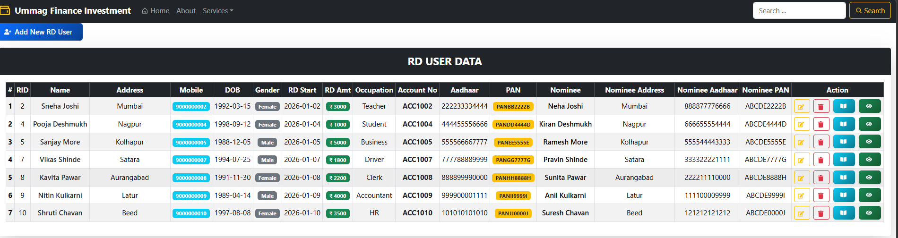
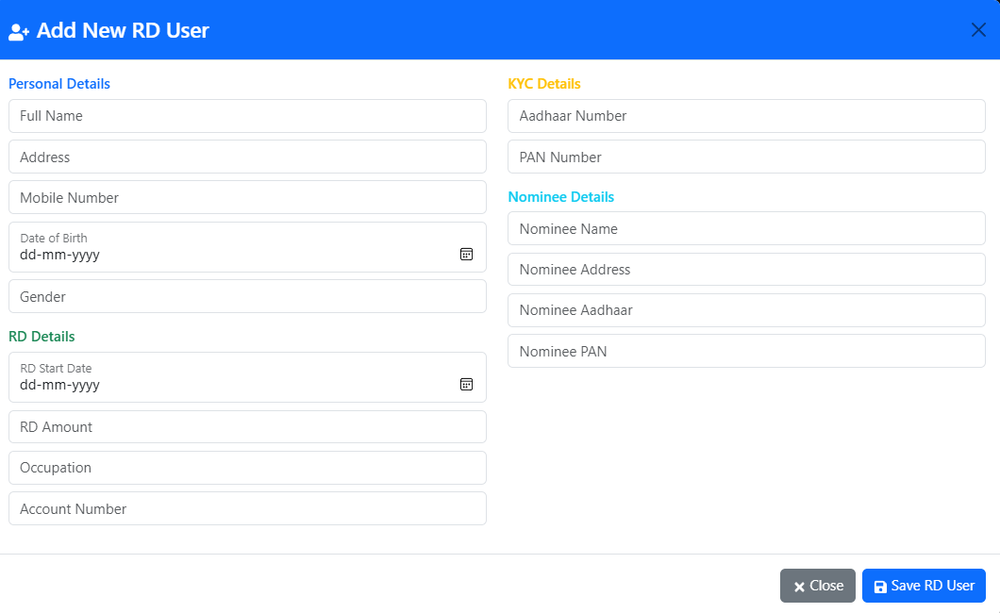
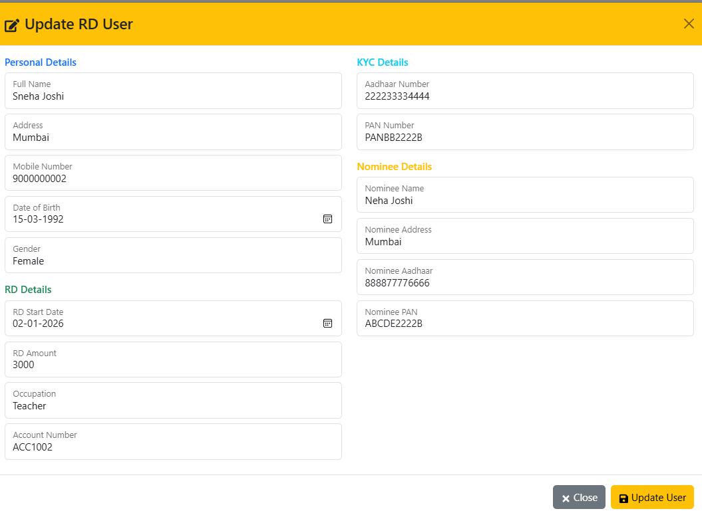
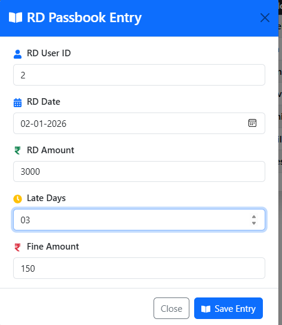
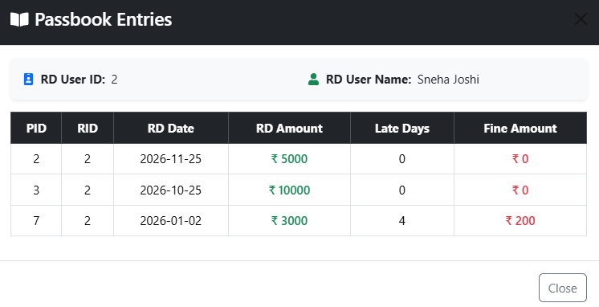

# 💰 RDsystem - Recurring Deposit Management

A robust **Full-Stack Finance Application** built with the Spring Boot-React ecosystem. This system automates recurring deposit tracking, handles user KYC, and features a smart automated fine calculation engine.

---

## 🚀 Key Features

* **Advanced Dashboard:** High-level overview of all RD holders with integrated KYC tracking (PAN/Aadhaar).
* **Full CRUD Lifecycle:** Professional modules to **Add, View, and Update** user profiles, RD amounts, and nominee details.
* **Smart Passbook Entry:** Digital ledger to log monthly installments with zero manual error.
* **Automated Fine Engine:** System-calculated **'Late Days'** and **'Fine Amount'** based on payment delays.
* **Data Integrity:** Secure handling of personal and financial data across the stack.

---

## 🛠 Tech Stack

| Layer | Technologies |
| :--- | :--- |
| **Frontend** |    |
| **Backend** |   |
| **Database** |  |

---

## 📸 Project Preview

### 🖥️ Main Dashboard
Complete user database with quick action buttons for editing and viewing passbooks.

### ⚙️ User Management (Add & Update)
Dynamic forms with validation for onboarding and updating user records.
| ➕ Add New RD User | 📝 Update User Details |
| :---: | :---: |
|  |  |

### 📖 Passbook & Fine Calculation
Automated tracking of installment dates and late fee generation.
| 📥 New Passbook Entry | 📊 Transaction Ledger |
| :---: | :---: |
|  |  |

---

## ⚙️ Installation

1. **Clone:** `git clone https://github.com/anchal-baghel/RdSystem.git`
2. **Frontend:** `npm install` && `npm run dev`
3. **Backend:** Update `application.properties` and run the Spring Boot JAR/IDE.

---

## 🤝 Contact
**Anchal Baghel** - [LinkedIn](https://www.linkedin.com/in/anchal-baghel/) | [Portfolio](https://anchalbaghel.netlify.app)
